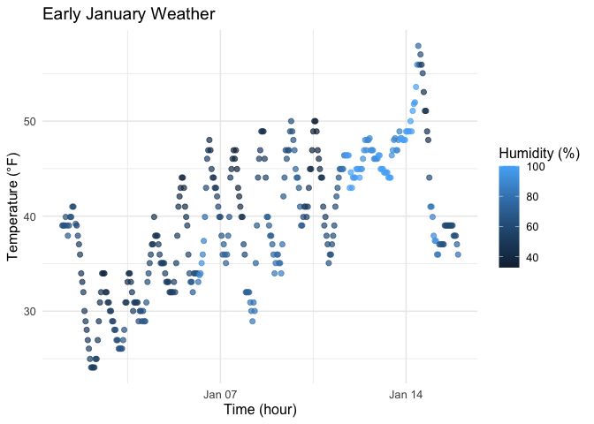

p8105_hw1_wd2311
================
wd2311
2025-09-20

Loading packages

``` r
library(tidyverse)
```

    ## ── Attaching core tidyverse packages ──────────────────────── tidyverse 2.0.0 ──
    ## ✔ dplyr     1.1.4     ✔ readr     2.1.5
    ## ✔ forcats   1.0.0     ✔ stringr   1.5.1
    ## ✔ ggplot2   3.5.2     ✔ tibble    3.3.0
    ## ✔ lubridate 1.9.4     ✔ tidyr     1.3.1
    ## ✔ purrr     1.1.0     
    ## ── Conflicts ────────────────────────────────────────── tidyverse_conflicts() ──
    ## ✖ dplyr::filter() masks stats::filter()
    ## ✖ dplyr::lag()    masks stats::lag()
    ## ℹ Use the conflicted package (<http://conflicted.r-lib.org/>) to force all conflicts to become errors

``` r
library(ggplot2)
library(moderndive)
```

# Problem 1

### Load Data

Load the early_january_weather dataset from moderndive library

``` r
data("early_january_weather")
```

### Quick description

This dataset has 358 rows and 15 columns.  
The variables include: origin, year, month, day, hour, temp, dewp,
humid, wind_dir, wind_speed, wind_gust, precip, pressure, visib,
time_hour  
The mean temperature is about 39.58212.

``` r
weather <- early_january_weather
names(weather)
```

    ##  [1] "origin"     "year"       "month"      "day"        "hour"      
    ##  [6] "temp"       "dewp"       "humid"      "wind_dir"   "wind_speed"
    ## [11] "wind_gust"  "precip"     "pressure"   "visib"      "time_hour"

``` r
nrow(weather)
```

    ## [1] 358

``` r
ncol(weather)
```

    ## [1] 15

``` r
mean(weather$temp, na.rm = TRUE)
```

    ## [1] 39.58212

### Scatterplot

Temperature generally increase from beginning to the middle of the
month, except for a sudden drop at Jan 15. Also there is a daily pattern
of dipping overnight and rising during daytime hours. Points with higher
humidity tend to cluster around Jan 11 to Jan 14, with lower daily
temperature variation.

``` r
plot_temp_hour <-
  ggplot(weather, aes(x = time_hour, y = temp, color = humid)) +
  scale_color_continuous(name = "Humidity (%)") +
  geom_point(alpha = 0.7, size = 1.8) +
  labs(
    x = "Time (hour)",
    y = "Temperature (°F)",
    title = "Early January Weather"
  ) +
  theme_minimal(base_size = 12)

plot_temp_hour
```

<!-- -->

``` r
ggsave(filename = "temp_vs_time_humid.png",
       plot = plot_temp_hour, width = 7, height = 4.5, dpi = 300)
```

# Problem 2

### Create data frame

``` r
problem2_df <- tibble(
  num_var = rnorm(10),
  log_var = num_var > 0,
  char_var = letters[1:10],
  fact_var = factor(rep(c("low", "med", "high"), length.out = 10))
)

problem2_df
```

    ## # A tibble: 10 × 4
    ##    num_var log_var char_var fact_var
    ##      <dbl> <lgl>   <chr>    <fct>   
    ##  1 -0.757  FALSE   a        low     
    ##  2 -0.0215 FALSE   b        med     
    ##  3  0.675  TRUE    c        high    
    ##  4  0.522  TRUE    d        low     
    ##  5 -0.625  FALSE   e        med     
    ##  6  1.26   TRUE    f        high    
    ##  7 -0.262  FALSE   g        low     
    ##  8 -1.16   FALSE   h        med     
    ##  9 -0.427  FALSE   i        high    
    ## 10 -0.393  FALSE   j        low

### take the mean of each variable

The first two variable (numeric and logical vecotr) can calculate for
numeric mean, the last two cannot because they are not numeric.

``` r
mean(problem2_df %>% pull(num_var))    
```

    ## [1] -0.1190496

``` r
mean(problem2_df %>% pull(log_var))   
```

    ## [1] 0.3

``` r
mean(problem2_df %>% pull(char_var))
```

    ## Warning in mean.default(problem2_df %>% pull(char_var)): argument is not
    ## numeric or logical: returning NA

    ## [1] NA

``` r
mean(problem2_df %>% pull(fact_var)) 
```

    ## Warning in mean.default(problem2_df %>% pull(fact_var)): argument is not
    ## numeric or logical: returning NA

    ## [1] NA

### Convert to numeric and retry

For the logical vector, TRUE is converted to 1 and FALSE is converted to
0. For the character vector, they cannot be converted For the factor
vector, the three categories are converted to 1, 2, 3.

``` r
as.numeric(problem2_df$log_var)   
```

    ##  [1] 0 0 1 1 0 1 0 0 0 0

``` r
as.numeric(problem2_df$char_var)    
```

    ## Warning: NAs introduced by coercion

    ##  [1] NA NA NA NA NA NA NA NA NA NA

``` r
as.numeric(problem2_df$fact_var) 
```

    ##  [1] 2 3 1 2 3 1 2 3 1 2
